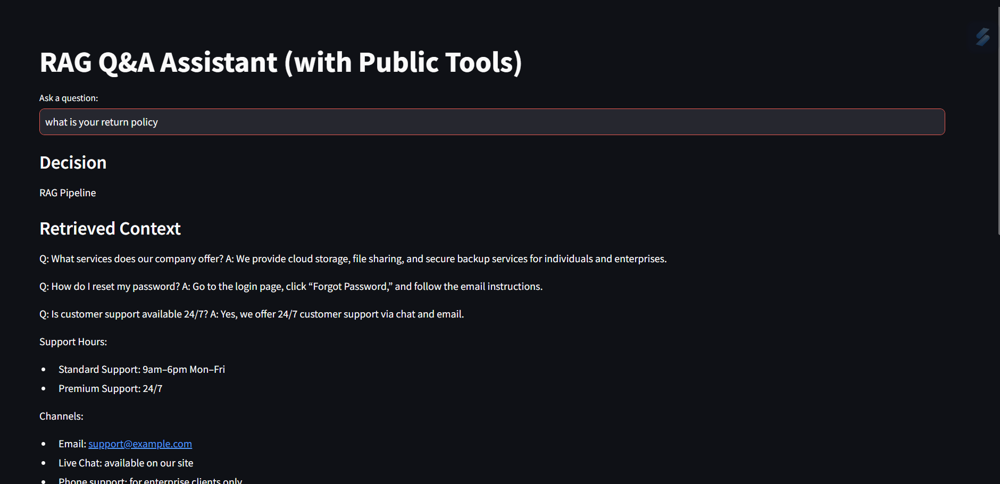
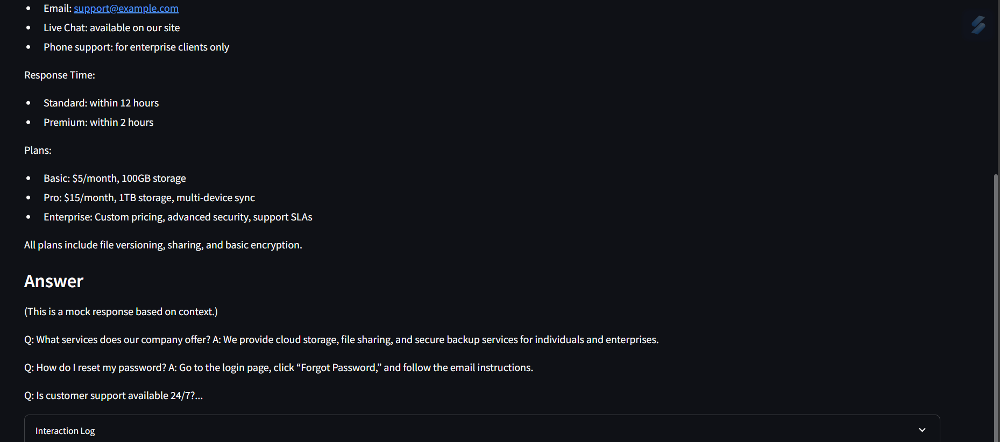

# 🧠 RAG-Powered Multi-Agent Q&A Assistant

This project is a multi-agent knowledge assistant that combines **retrieval-augmented generation (RAG)** with simple **tool-based routing** (calculator and dictionary). It is implemented in two variants:

- ✅ **Version 1: Offline/Free** – No OpenAI key required
- ✅ **Version 2: Online/OpenAI-Powered** – Uses GPT-3.5 with Chroma for better answers

---

## 🏗️ Architecture Overview

| Component       | Offline Version                                | Online Version             |
| --------------- | ---------------------------------------------- | -------------------------- |
| Embeddings      | `HuggingFaceEmbeddings`                        | `OpenAIEmbeddings`         |
| Vector Store    | `FAISS`                                        | `Chroma`                   |
| LLM Response    | Mock response                                  | `gpt-3.5-turbo` via OpenAI |
| Dictionary Tool | [dictionaryapi.dev](https://dictionaryapi.dev) | Same                       |
| Calculator Tool | [api.mathjs.org](https://api.mathjs.org)       | Same                       |

---

## 🧠 Agent Workflow Logic

1. **If query includes `define`** → Use dictionary tool
2. **If query includes `calculate`** → Use calculator tool
3. **Otherwise** → Run RAG Pipeline:
   - Embed the query
   - Retrieve top 3 relevant text chunks
   - Generate a natural language answer (mock or LLM)

---

## 📁 File Structure

├──app1.py # Hugging Face Streamlit app (version 1 )
├──app2.py # Open AI Streamlit app (version 2)
├── docs/ # Folder containing .txt source documents
├── .env # API keys
├── requirements.txt # Python dependencies
└── README.md # This file

---

## 🚀 How to Run

### 1. Install Dependencies

```bash
pip install -r requirements.txt
```

Create a .env that includes
OPENAI_API_KEY=your_openai_key
LANGCHAIN_API_KEY=your_langchain_key

## 4 Start the App

streamlit run app.py



